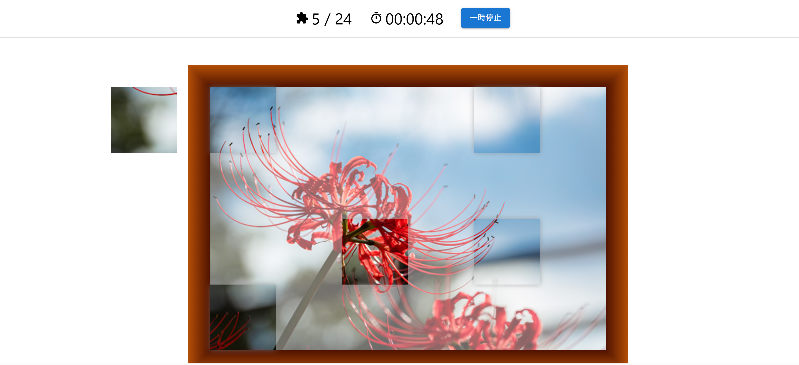

# Jigsaw Like Puzzle
2020/05/18～5/24で開催された、#web1week の制作物です。  
『1週間でWebサービスを作るイベント - お題「Like」』  
（このイベントが開催された Crieit は現在サービスクローズしています）



作成後も各種パッケージ等のアプデといったメンテナンスは少しやっています。

## 環境
base
- Node.js：24.11.1
- TypeScript：5.9.2
- React：19.1.1

Other major libraries
- MUI：
  - material
  - icons-material
- React Konva

## 開発環境構築
- .env を作成
  ※内容は別途管理

- ライブラリのインストール
```bash
npm install
```

- ローカルサーバ起動
```bash
npm run dev
```
